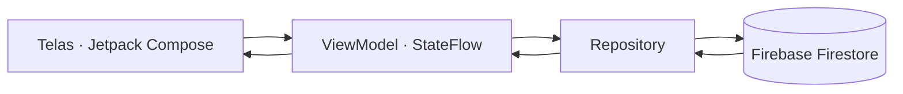

<div align="center">


# RegiCondo

### Atualização de Regimentos Internos

Gestão digital de cláusulas condominiais, atas de assembleia e histórico de aprovações.


</div>

---

## Sobre o projeto

O **RegiCondo** é um aplicativo Android desenvolvido em **Kotlin** com **Jetpack Compose**, integrado ao **Firebase Firestore**, para apoiar síndicos, conselheiros e moradores na gestão do regimento interno de um condomínio.

O app organiza três frentes de trabalho que normalmente vivem espalhadas em atas impressas, planilhas e grupos de mensagens:

- **Cláusulas do regimento** — o texto normativo em si, com categoria, status (vigente, em revisão, revogada) e controle de versão.
- **Atas de assembleia** — o registro formal das reuniões em que o regimento é discutido e alterado.
- **Histórico de aprovações** — o resultado das votações que validam (ou não) cada alteração proposta.

Todas as informações são gravadas e sincronizadas em tempo real no Firebase Firestore, permitindo consultar o regimento atualizado a qualquer momento.

> Projeto desenvolvido por **Mariana de Oliveira Rigueiro** para a disciplina de **Programação de Aplicativos Mobile**, a partir do tema *"Atualização de Regimentos Internos: CRUD de cláusulas condominiais, atas de assembleias e histórico de aprovações"*.

## Funcionalidades

| Módulo | Criar | Ler | Atualizar | Excluir |
|---|:---:|:---:|:---:|:---:|
| Cláusulas do regimento | ✅ | ✅ | ✅ | ✅ |
| Atas de assembleia | ✅ | ✅ | ✅ | ✅ |
| Histórico de aprovações | ✅ | ✅ | ✅ | ✅ |

- Sincronização em tempo real com o Firebase Firestore (`addSnapshotListener`).
- Navegação entre telas com Navigation Compose.
- Arquitetura em camadas (UI → ViewModel → Repository → Firestore).
- Identidade visual própria, aplicada de forma consistente em todas as telas.

## Identidade visual

### Conceito

A identidade parte do universo que o app organiza: documentos normativos, selos de aprovação e assembleias formais. Por isso a linguagem visual evita o estilo "app de consumo" (cores vivas, cantos muito arredondados) e se aproxima do universo de **documentos institucionais** — azul de autoridade, dourado de selo oficial e uma superfície neutra que lembra papel timbrado.

### Paleta de cores

| Token | Cor | Hex | Uso |
|---|---|---|---|
| `azul-institucional` | 🟦 | `#1B3A5C` | Cor primária — barra superior, botões principais, títulos |
| `azul-profundo` | 🟦 | `#10263B` | Variante escura — gradientes, estados pressionados |
| `dourado-selo` | 🟨 | `#B8912B` | Cor de destaque — ícones, selos, elementos de ênfase (uso pontual) |
| `papel` | ⬜ | `#EEF1F4` | Fundo das telas |
| `superficie` | ⬜ | `#FFFFFF` | Cards e campos de formulário |
| `texto-principal` | ⬛ | `#20242B` | Texto principal |
| `texto-secundario` | ⬛ | `#5B6470` | Texto de apoio, legendas |
| `status-vigente` | 🟩 | `#2F7D4F` | Cláusula vigente / ata aprovada |
| `status-revisao` | 🟧 | `#C17D2B` | Em revisão / pendente |
| `status-revogada` | 🟥 | `#A6403A` | Revogada / rejeitada |

O dourado é usado com moderação — como um selo, não como cor de fundo — para preservar o caráter institucional da paleta.

### Tipografia

- **Títulos e cabeçalhos:** `Spectral` (serifada, remete a documentos impressos e atas formais).
- **Corpo de texto e componentes de interface:** `IBM Plex Sans` (sem serifa, alta legibilidade em telas pequenas).
- Caso não queira importar fontes customizadas, o app funciona normalmente com a fonte padrão do sistema (Roboto) — o passo a passo de como adicionar as fontes está no `TUTORIAL.md`.

### Logo

O símbolo combina três elementos do tema: um **prédio estilizado** (o condomínio), **linhas de texto** dentro dele (as cláusulas do regimento) e um **selo verde de aprovação** no canto (o histórico de aprovações), emoldurados por um anel dourado sobre fundo azul-institucional.

Arquivo: [`logo.svg`](logo.svg)

## Arquitetura



O app segue o padrão **MVVM**: as telas observam estados expostos pelo ViewModel; o ViewModel chama o Repository; o Repository é a única camada que conversa diretamente com o Firestore.

## Estrutura de pastas

```
app/src/main/java/com/mariana/regicondo/
├── data/
│   ├── model/
│   │   ├── ClausulaCondominial.kt
│   │   ├── AtaAssembleia.kt
│   │   └── HistoricoAprovacao.kt
│   └── repository/
│       ├── ClausulaRepository.kt
│       ├── AtaRepository.kt
│       └── HistoricoRepository.kt
├── ui/
│   ├── theme/
│   │   ├── Color.kt
│   │   ├── Type.kt
│   │   └── Theme.kt
│   ├── navigation/
│   │   ├── Tela.kt
│   │   └── AppNavigation.kt
│   └── screens/
│       ├── home/HomeScreen.kt
│       ├── clausulas/ListaClausulasScreen.kt
│       ├── clausulas/FormClausulaScreen.kt
│       ├── atas/ListaAtasScreen.kt
│       ├── atas/FormAtaScreen.kt
│       ├── historico/ListaHistoricoScreen.kt
│       └── historico/FormHistoricoScreen.kt
├── viewmodel/
│   ├── ClausulaViewModel.kt
│   ├── AtaViewModel.kt
│   └── HistoricoViewModel.kt
└── MainActivity.kt
```

## Modelo de dados no Firestore

```
firestore/
├── clausulas/{clausulaId}
│   titulo, categoria, descricao, status, versao, dataAtualizacao
├── atas/{ataId}
│   titulo, tipo, data, pauta, decisoes, presentes
└── historico_aprovacoes/{historicoId}
    clausulaTitulo, dataAprovacao, votosFavor, votosContra, votosAbstencao, status
```

## Tecnologias utilizadas

- [Kotlin](https://kotlinlang.org/)
- [Jetpack Compose](https://developer.android.com/jetpack/compose) + Material 3
- [Navigation Compose](https://developer.android.com/jetpack/compose/navigation)
- [Firebase Firestore](https://firebase.google.com/docs/firestore)
- Coroutines + `StateFlow` (arquitetura MVVM)

## Como executar o projeto

1. Clone o repositório:
   ```
   git clone https://github.com/SEU-USUARIO/regicondo.git
   ```
2. Abra a pasta no **Android Studio** e aguarde a sincronização do Gradle.
3. Crie um projeto no [Firebase Console](https://console.firebase.google.com/), registre um app Android com o pacote `com.mariana.regicondo` e baixe o arquivo `google-services.json`.
4. Copie o `google-services.json` para a pasta `app/` do projeto.
5. Ative o **Cloud Firestore** no Firebase Console.
6. Rode o app em um emulador ou dispositivo físico.

O passo a passo completo, com todo o código comentado, está em [`TUTORIAL.md`](TUTORIAL.md).

## Capturas de tela

> Adicione aqui os prints das telas do app após a execução (Home, lista de cláusulas, formulário, atas e histórico). Recomenda-se criar uma pasta `docs/screenshots/` no repositório e referenciá-la abaixo:
>
> ```
> 
> 
> ```

## Vídeo de demonstração

📹 Link do vídeo: *[adicionar aqui após a gravação]*

O vídeo mostra a criação do projeto, o funcionamento do CRUD nas três telas e a conferência dos dados diretamente no Firebase Firestore.

## Autoria

**Mariana de Oliveira Rigueiro**
Disciplina: Programação de Aplicativos Mobile
Tema: Atualização de Regimentos Internos — CRUD de cláusulas condominiais, atas de assembleias e histórico de aprovações.

---

<div align="center">
<sub>Projeto acadêmico desenvolvido para fins educacionais.</sub>
</div>
